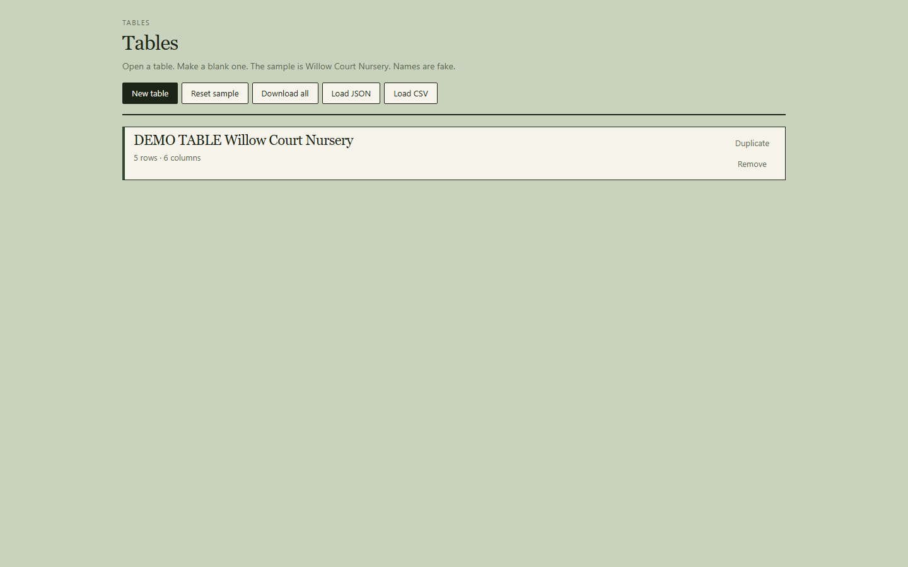
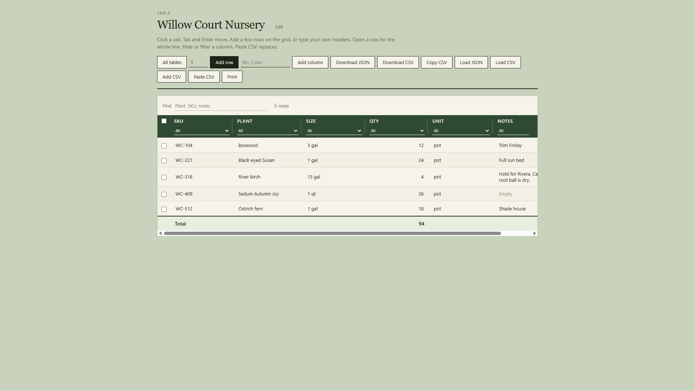
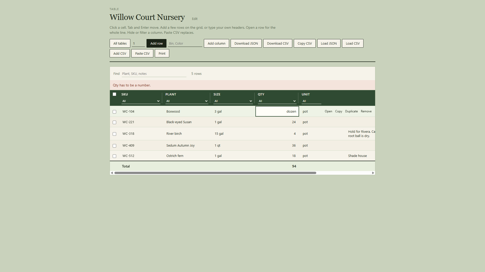

# Tables

Editable tables for a count you already keep. Click a cell. Add a
row. Keep more than one table. Search. Sort. Load and download JSON
or CSV. Drop `src/lib/` into a React app you already have.

Try it:
https://aaronlb912.github.io/tables/

Tables on that page stay in your browser. Get the files if you want
the grid in your own app.

The demo starts on the table list. DEMO TABLE Willow Court Nursery
is the sample. Names are fake. Open it, or make a blank table.

## Who it is for

A shop or crew that already runs React and needs a table of rows on
a page. Put your columns and counts in. Save the JSON or CSV.

## What you get

Copy `src/lib/`. That folder is the component.

- `Workspace.jsx` - table list plus the open table
- `Table.jsx` - one table
- `RowPage.jsx` - add row and edit row
- `table.css` - the look
- `table-json.js` - download, load parse, CSV, blank template
- `sample-table.js` - Willow Court Nursery sample
- `index.js` - the import

No account. Nothing sends mail. A new table starts empty with Name,
Qty, and Notes. You cannot remove the last table. The demo keeps
tables after a refresh (Reset sample on the list if you want Willow
Court back). Click a cell to type. Tab moves to the next cell. Enter moves
down. Add row puts a blank line on the grid. Set how many to add
a few at once. Type a header name, or two names with a comma, then
Add column. Open a row
to edit the whole line. Notes is a longer box. Escape cancels. Click a column
name to sort. Quiet Edit and Remove on a column. Quiet
Open, Duplicate, Copy, and Remove on a row. Qty (or Count / Amount /
Quantity) totals at the bottom. A bad number on that column misses.
Drag a row or a column to change order. Drag a header edge to resize.
Hide a column on the grid (Show puts it back). Filter a header to
one value or Empty. Check rows and remove the selected ones. Copy
CSV. Paste CSV replaces the open table. Add CSV or Shift+paste adds
rows by column name. Print this table. Find highlights matches.
The first column, the header, and the row actions stay when you
scroll. Undo after Remove on a row or a column.

## Run the demo

Live: https://aaronlb912.github.io/tables/

Files: https://github.com/Aaronlb912/tables

On your machine:

```
npm install
npm start
```

Open http://127.0.0.1:48721/

## Demo







https://github.com/user-attachments/assets/e2f5f830-e9f4-478a-b005-92ca967a2a8d

Repo copy: [docs/media/tables-demo.mp4](docs/media/tables-demo.mp4)

Voice is Microsoft Andrew Neural. Music is Wallpaper by Kevin MacLeod (incompetech.com), CC BY 3.0.

## Use it in your own React app

1. Copy the `src/lib/` folder into your project (for example
   `src/lib/`).
2. Import the workspace (several tables) or the table (one table).

Several tables:

```jsx
import { useState } from 'react'
import { Workspace, sampleWorkspace } from './lib/index.js'

export function Stock() {
  const [workspace, setWorkspace] = useState(sampleWorkspace)
  return <Workspace value={workspace} onChange={setWorkspace} />
}
```

One table:

```jsx
import { useState } from 'react'
import { Table, sampleTable } from './lib/index.js'

export function Stock() {
  const [table, setTable] = useState(sampleTable)
  return <Table value={table} onChange={setTable} />
}
```

Change the title and the rows. Edit `src/lib/table.css` if you want
a different look.
